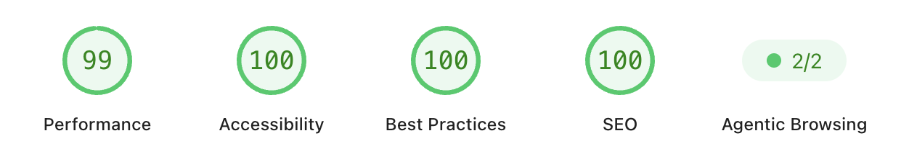

# Frontend Mentor - QR code component solution

This is a solution to the [QR code component challenge on Frontend Mentor](https://www.frontendmentor.io/challenges/qr-code-component-iux_sIO_H). Frontend Mentor challenges help you improve your coding skills by building realistic projects.


## Table of contents

- [Overview](#overview)
  - [Links](#links)
- [My process](#my-process)
  - [Built with](#built-with)
  - [What I learned](#what-i-learned)
  - [Continued development](#continued-development)
  - [Useful resources](#useful-resources)

**Note: Delete this note and update the table of contents based on what sections you keep.**

## Overview

### PageSpeed Insights



### Links

- [Solution](https://github.com/JammiM/qr-code-component-fem)
- [Live Site](https://jammim.github.io/qr-code-component-fem/)

### Built with

- Semantic HTML5 markup
- CSS custom properties
- Vite
- Stylelint
- Eslint
- Scss
- Postcss
- Autoprefixer
- Axe-core
- Github Actions
- Google lighthouse

### What I learned

The need to put fetchpriority="high" on a img, to help with the inital load of a page.

```html

```

Using more font-sizes that are more accessibility oriented

```css
.qr-code-card__heading {
  font-size: clamp(1.1875rem, 1.12rem + 0.28vw, 1.375rem);
}
```

### Continued development

I'm working towards using Linear Interpolation to manually calculate the desired clamp() slope without guessing.

### Useful resources

These are an amazing article's which helped me.

- https://web.dev/learn/design/typography

- https://clampgenerator.com/guides/layout-size-width-height-css-clamp/

- https://css-tricks.com/linearly-scale-font-size-with-css-clamp-based-on-the-viewport/

- https://mediusware.com/blog/responsive-typography-with-clamp-css

- https://developer.chrome.com/docs/performance/insights/lcp-discovery

- https://developer.mozilla.org/en-US/docs/Web/HTML/Reference/Attributes/fetchpriority

- https://web.dev/articles/optimize-lcp#1_eliminate_resource_load_delay

- https://web.dev/articles/preload-scanner

- https://web.dev/articles/lcp-lazy-loading

- https://www.testmuai.com/blog/css-hover-effects/
